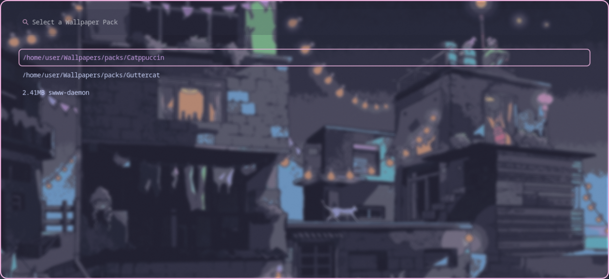

# wx_sweetpapers

## Dependencies

- Python
- swww (<https://github.com/LGFae/swww>)

## Description

Automatically sets multiple monitors to pre-determined 'packs' of wallpapers

`wx_sweetpapers` includes 3 Components

1. [Wallpaper Swapper](#wallpaper-swapper)
2. [Chrome Extension](#chrome-extension)
3. [HTTP Wallpaper Download Daemon](#http-wallpaper-download-daemon)
4. [Wofi Menu](#wofi-menu)

### Components

#### Wallpaper Swapper

Rotates between `packs` of wallpapers, randomly picking wallpapers
from these packs and painting them to the respective monitors.

#### Chrome Extension

Tries to find an element on the current active tab with the class `WX_ACTIVEIMAGE`,
and retrieve its `src`, if it cannot find an element like this, it uses
the active tabs URL as the images `src`. It then transmits the image
to the HTTP Download Daemon

#### HTTP Wallpaper Download Daemon

Basically, chrome extensions cannot automatically save to the file system,
they can 'download' using the browser API, or save to the browser storage.
But they cannot read or modify the base file system.

To get around this, we spin up a service that listens to HTTP requests
from the Chrome Extension. The chrome extension retrieves the image from
the active tab, and transmits it to the Download Daemon,
the download daemon then automatically names the image according to the
required schema `<monitor>_<index>.<extension>` i.e. `1.png, 1_2.png, 1_3.png, etc`
for the main Wallpaper Swapper to use

#### Wofi Menu

Allows for quick swapping between wallpaper packs

## TODO

- [ ] Convert HTTP-Daemon to Go?
